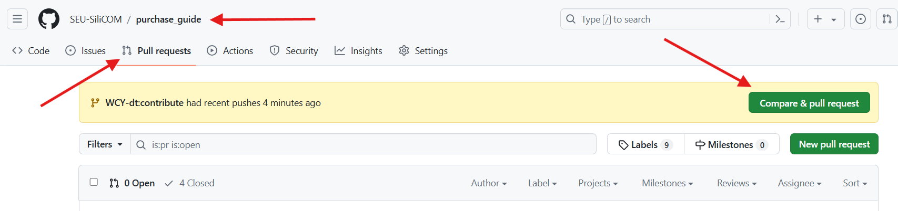

# 贡献本项目

> 如果你觉得使用 Git 较为困难，可以直接发起 [issue](https://github.com/SEU-SiliCOM/purchase_guide/issues) 提交你的建议或修改意见。
>
> 仓库管理员会帮你进行结对提交。

如果你想为本项目贡献文档或代码，请参考以下步骤：

1. [Fork 本项目](https://github.com/SEU-SiliCOM/purchase_guide/fork)

2. 将 **Fork 后的项目** Clone 到本地：

   ```bash
   git clone https://github.com/<你的GitHub用户名>/purchase_guide.git
   ```

3. 创建一个新分支并切换到该分支：

   ```bash
   git checkout -b <任意名称>
   ```

4. 对文件进行修改。修改完成后，可以在本地预览修改效果：

   ```bash
   docsify serve
   ```

   然后在浏览器中打开 `http://localhost:3000` 查看修改效果。

5. 提交修改并推送到远程仓库：

   ```bash
   git add .
   git commit -m "<提交信息>"
   git push origin <你的分支名称>
   ```

   > 提交信息请尽量简洁明了，不要包含无意义的信息。
   >
   > - 如果是修订文档，提交信息请以 `doc:` 开头
   > - 如果是修复 bug，提交信息请以 `fix:` 开头
   > - 如果是新增功能，提交信息请以 `feat:` 开头
   > - 其余修改请先提 [issue](https://github.com/SEU-SiliCOM/purchase_guide/issues) 讨论
   >
   > 如果修改了多处内容，请在每修改完一处后执行一次 `git add` 和 `git commit`。全部修改完后再一并执行 `git push`。

6. 在 GitHub 上提交 Pull Request

   

   等待仓库管理员审核后，即可合并到主分支。

7. 合并后，删除你自己的分支：

   ```bash
   git checkout main
   git branch -d <你的分支名称>
   git push origin --delete <你的分支名称>
   ```

   下次再贡献时，记得先更新你的仓库：

   ```bash
   git pull origin main
   ```

   然后再从第 3 步开始。
